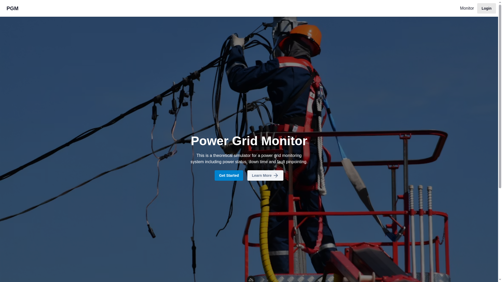
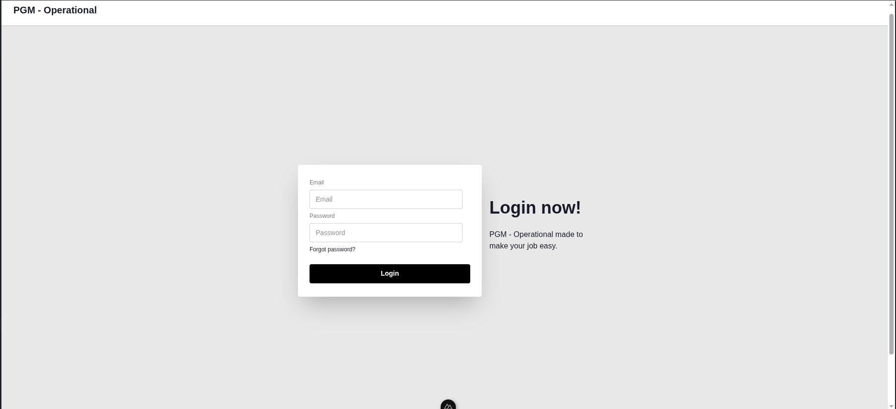
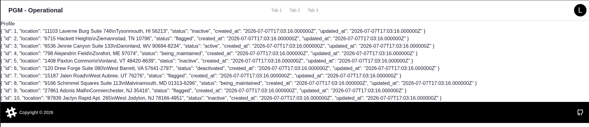

# Changelogs
## Contents
* [Day 1](#day-1-july-1--2026)
* [Day 2](#day-2-july-2--2026)
* [Day 6](#day-6-july-6--2026)
* [Day 7](#day-7-july-7--2026)

---

### Day 1 (July 1 / 2026)

<strong>Only Landing Page UI was implemented</strong>

- Today I implemented a simple landing page for the web app. I included a clear description of the platform's purpose and explicitly specified that it is a theoretical simulation.
- Here are screenshots of the UI implemented today:

  
  

---

### Day 2 (July 2 / 2026)
<small>Missed Changelog</small>
<strong>Design Decisions and Login UI</strong>

- A basic route called `/operational` was implemented.
- A basic login page was made.
  
  
- Some design decisions were documented in [philosophy](Philosophy.md) equivalent commit being [b545eba](https://github.com/zeroNhatty/power-gm/commit/b545eba1a0d5da40582a56c7008ace42459f18b8)

---

### Day 6 (July 6 / 2026)
<strong>Login Functionality</strong>
  
  - A working login system using [nuxt-auth-sanctum](https://nuxt.com/modules/nuxt-auth-sanctum)

---
### Day 7 (July 7 / 2026)

**User Session & access**

- System remembers user for 1 hour by storing them in cookies commit [2348964](https://github.com/zeroNhatty/power-gm/commit/2348964e2a0be56bcd35192fc2653d901b4f169e)
- Added a custom header component displayed after login (basic must be updated)
- default impelmentation of power nodes data model
- Simple structure rendering of raw power node data

