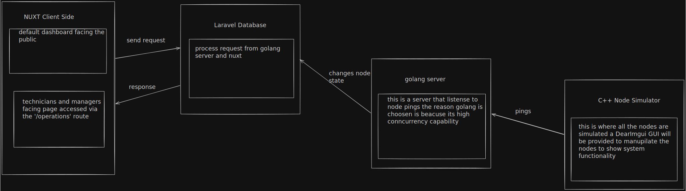
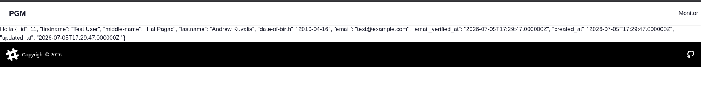

# Contents
- [Technicians Portal](#technician-portal)
- [Initial System Design](#initial-system-design)
- [Login Implementation Difficulties](#login-implementation-difficulties)

---

## Technician Portal
<small>This was written on July 2 / 2026</small>
<details>
<summary><strong>Access Method to Portal</strong></summary>

- up to this commit [4001b10](https://github.com/zeroNhatty/power-gm/commit/4001b10e819259fe6251caf16cdfbaba842db6ff) a Login button is at the Landing Page which is public. 
- Since the public shouldn't see or access internal infra the solution I thought of to isolate the technician portal is to use a hidden dedicated route called `/operations`  
</details>

<details>
<summary id="technician-tools-summary"><strong>Technicians Tools</strong></summary>

- On the initial design there were no decisions on what kind of tools the technicians will have but the general idea for those tools will be
  - Tracking incoming node signals and isolation of nodes
  - Node status overrides (maintenance, flagging node as faulty ...)
  - Realtime ticket system where technicians are assigned tickets so it can be handled accordingly
</details>

<details>
<summary><strong>Identity and Role Management</strong></summary>

- Inorder to have more control and make it easier to manage technicians we will disable access to the public as mentioned in [Technicians Tools](#technician-tools-summary)
- So to make managing of accounts easier we will add the Manager role which will have privileges like managing, activating and deactivating of accounts.
- Like the technicians the mangers will use the `/operational` route to access there page (Note: Pages the managers and technicians use will be different)
</details>

---

## Initial System Design
<small>This was written on July 2 / 2026</small>
- On commit [2e3be05](https://github.com/zeroNhatty/power-gm/commit/2e3be057a4e97674ef6225366abfa05340c00649) I mentioned that the [power-gm-server](https://github.com/zeroNhatty/power-gm-server.git) development should be started. So I started by asking myself a few questions
  <details>
    <summary><i><strong>
      What will the server do?
    </strong></i></summary>
  
    - It will host the database and the nodes will ping the server.
  </details>

  <details>
    <summary><i><strong> 
      Would laravel be able to handle both nodes pinging it and client machines making requests?
    </strong></i></summary>
  
    - I am not familiar with Laravel memory footprint, but I know php isn't the best when it comes to concurrency. 
    - So I saw a need to separate the server into 2 parts:
      - One that handles client side requests and database 
      - The other listens to the node pings keeps tracks of their activities and notifies the Laravel section of the code to make changes depending on the node status.
  </details>

  <details>
    <summary><i><strong>
      Why does the golang section of the code keep track of the status of the nodes?
    </strong></i></summary>

    - I have a few reasons to do that:
      - The Laravel section of the code is handling the CRUD operations, processing client side requests, and pushing updates to the client. We know Laravel is made to handle those actions but when the number of users and nodes increase it will make our system use up alot more memory and cpu time which isn't ideal.
      - Golang statically links on build which makes it ideal because there is no external dependencies.
      - Golang excels in concurrency by design.
  </details>

  <details>
    <summary><i><strong>
      How will the nodes be simulated?
    </strong></i></summary>
  
  - For the node simulation I wanted to stay true to the embedded system architecture and use `C++`.
  - The reason I opted for `C++` rather than `C` is because I will need some sort of gui to control the nodes, and it's easier to a gui using `C++` compared to `C`.
  - It works by enabling, disabling, overfeeding and underfeeding a node and the nodes ping the go server endpoint and the Golang script process the pings or no pings and act accordingly.
  </details>

- Here is a very crude design of the system: 

but I had a few gray areas with the initial design I made:
<details>
  <summary><strong>
    Gray areas about intial design:
  </strong></summary>

  - What if we have millions of node how would the Golang server handle that?
  - Would -rw operations be done on every update of a node? (prolly not)
  - How do I handle multiple -rw operations on the DB?
  - What should be the DB?
</details>

<small>This was written on July 3 / 2026</small>
```
After a bit of consoltation I have decided to keep it simple for now and revisit the issue after a stable version is ready.
```

---
## Login Implementation Difficulties
<small>This was written on July 6/ 2026</small>

<strong>Challenges During Login Implementation</strong>

- Initially, I was planning to make the authentication on the server side, but after 2 days of struggling, I started noticing most documentations, videos,
    and articles all suggest to keep login, logout, and update user on the client side. So I started to implement the authentication on the client side,
    but I had a hard time trying to figure out how to do csrf-cookie and xsrf-token auth. I spent around half a day trying to do that, 
    but eventually found the [nuxt-auth-sanctum](https://nuxt.com/modules/nuxt-auth-sanctum) module, which made things far more easier. Now I can authenticate and fetch the authenticated user.

- Here is a preview of that:
  

